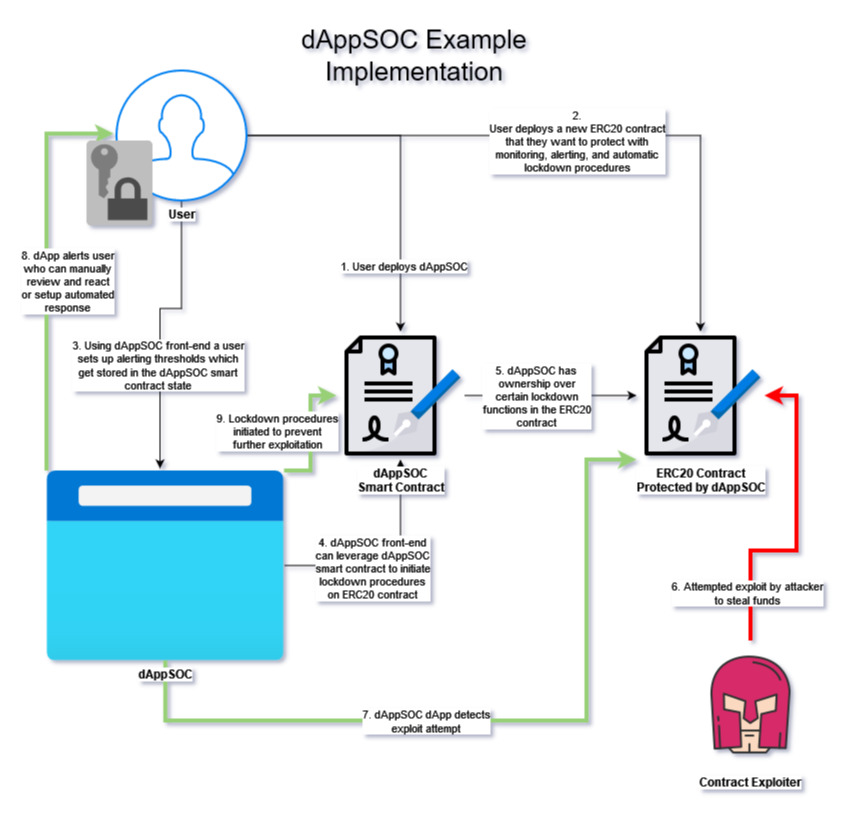

# blockchain-developer-bootcamp-final-project

## Project Ideas

### Smart Contract Monitoring and Alerting dApp (dAppSOC)

This dApp's purpose is to help detect and prevent smart contract exploitation attempts. A front-end would be used to view alerts and customize alerting thresholds. The front-end would rely on a smart contract to initiate lockdown procedures on a target contract. Some potential items that will be alerted on would be privileged transactions, large value transfers, and other abnormal behaviour as specified by the user. 

**Features**
Generates alerts for:
- Privileged transactions such as ones called by owner
- Large value transfers
- Ownership transfer
- Abnormal behavior to certain functions
- ???

Automatically initiates lockdown procedures for functions during abnormal behavior such as timelocks, and "break glass admin" ownership provisioning

Potential address reputation checks

**General User Workflow**
1. User creates a new ERC20 contract that they want to protect with monitoring, alerting, and automatic lockdown procedures
2. Implementing the dAppSOC contract they are able to monitor certain functions of the ERC20 contract
3. Leveraging dAppSOC the user can specify expected behavior, and appropriate reactions during exploit attempts
4. Upon attempted exploitation of the ERC20 contract the dApp alerts the user to the activity and can initiate lockdown procedures

**Pseudocode**

